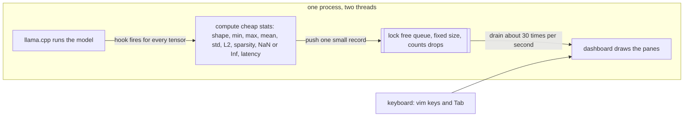

# Local_LLM_Instrumentation

A terminal based, non invasive live debugger for local transformer language models.

When a language model runs, it pushes your text through many layers of math, and normally
you cannot watch what happens inside while it runs. This tool lets you watch. It attaches to
a running [llama.cpp](https://github.com/ggml-org/llama.cpp) inference through ggml's built in
`cb_eval` callback, measures a few cheap numbers for every tensor of every layer, and streams
that telemetry into a keyboard driven terminal dashboard. It never changes the model or its
code, which is what "non invasive" means. Think of it as btop or lazygit, but for a model's
forward pass.

It also has a sidecar mode that does the same thing for PyTorch and TensorFlow models running
in Python, by sending the telemetry over a local network socket into the very same dashboard.

Status: working MVP. The main target is llama.cpp and GGUF models, as a single C++ program.
See [`docs/implementation-roadmap.md`](docs/implementation-roadmap.md) for the full component
breakdown, and [`docs/product-requirements.md`](docs/product-requirements.md) for the goals.

## Why it exists

Debugging a model today usually means one of two painful options. You either add a lot of
logging directly into the model code, which is intrusive and slow, or you use heavy separate
tools after the run is finished, which cannot show you what happened live. This project gives
you a third option: a fast, live, read only view of the forward pass, with almost no setup and
without touching the model.

## What it shows

The dashboard has six panes. Press Tab to move focus between them, and use vim style keys
inside the focused pane.

1. Model Topology. The structure of the model as a tree, built live just from the tensor
   names with no hard coding. Move with j and k, and press Space to set a layer as the capture
   target. Each layer shows the total time spent in it, so the slowest block stands out.
2. Live Packet Stream. Every tensor operation in the order it happened, with an id, a
   timestamp, the operation type, and the device. Press the forward slash key to filter the
   list live, and Escape to clear the filter.
3. Attention Matrix. The attention heatmap for the selected layer and head. Move around it
   with h, j, k, and l, change the contrast with plus and minus, and press capital F to make it
   fill the screen.
4. Runtime Metrics. For the selected tensor: shape, data type, a sparsity bar, latency, the
   value range, the mean, the standard deviation, the L2 norm, and a NaN or infinity flag.
5. Latency Flamegraph. Bars that rank the layers by how much compute time they used.
6. Anomaly Ledger. A running log of problems such as NaN or infinity values, unusually large
   numbers, and operations that fell back to the CPU, each with a timestamp and a severity.

## How it works

Everything runs inside one program with two threads. The first thread runs the model. Every
time the engine computes a tensor, it calls the hook, which measures a few cheap numbers and
drops a small fixed size record into a queue. The second thread is the dashboard, which empties
the queue about thirty times per second and redraws. The queue has a fixed size, so if the
model produces records faster than the screen can show them, the queue drops the extra records
and counts how many it dropped. This way the model is never slowed down waiting for the screen,
and memory never grows without limit.

The hook computes only lightweight stats inline and pushes a plain old data record called a
`TensorEvent` through the queue. The heavy attention matrix is captured on the side, and only
for the selected layer, so the hot path stays cheap. That same `TensorEvent` record is the one
contract used everywhere: it travels through the queue, it is written to disk for recording,
and it is sent across the network for the sidecar. Because it is the same structure in all
three places, the dashboard code is reused without changes.

## Notes and limitations

1. The attention pane needs flash attention to be off, which is the default here. When flash
   attention is on, llama.cpp never builds the attention matrix, so the pane shows a short
   message instead of a heatmap.
2. The full attention matrix, of size queries by keys, appears while the prompt is being read
   in. During single token generation you instead see one row of attention.
3. The MVP is CPU first. Tensors on a GPU are detected, but their statistics are sampled on the
   host side only.
4. Attention is captured live and is not part of the recorded session file, because it is
   handled on a side channel rather than through the main event stream.
