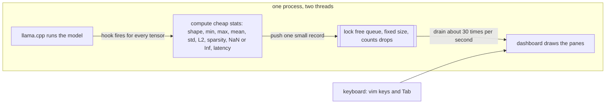

# Local_LLM_Instrumentation

A terminal based, non invasive live debugger for local transformer language models.

When a language model runs, it pushes your text through many layers of math, and normally
you cannot watch what happens inside while it runs. This tool lets you watch. It attaches to
a running [llama.cpp](https://github.com/ggml-org/llama.cpp) inference through ggml's built in
`cb_eval` callback, measures a few cheap numbers for every tensor of every layer, and streams
that telemetry into a keyboard driven terminal dashboard. It never changes the model or its
code, which is what "non invasive" means. Think of it as btop or lazygit, but for a model's
forward pass.

It also has a sidecar mode that does the same thing for PyTorch and TensorFlow models running
in Python, by sending the telemetry over a local network socket into the very same dashboard.

Status: working MVP. The main target is llama.cpp and GGUF models, as a single C++ program.
See [`docs/implementation-roadmap.md`](docs/implementation-roadmap.md) for the full component
breakdown, and [`docs/product-requirements.md`](docs/product-requirements.md) for the goals.

## Why it exists

Debugging a model today usually means one of two painful options. You either add a lot of
logging directly into the model code, which is intrusive and slow, or you use heavy separate
tools after the run is finished, which cannot show you what happened live. This project gives
you a third option: a fast, live, read only view of the forward pass, with almost no setup and
without touching the model.

## What it shows

The dashboard has six panes. Press Tab to move focus between them, and use vim style keys
inside the focused pane.

1. Model Topology. The structure of the model as a tree, built live just from the tensor
   names with no hard coding. Move with j and k, and press Space to set a layer as the capture
   target. Each layer shows the total time spent in it, so the slowest block stands out.
2. Live Packet Stream. Every tensor operation in the order it happened, with an id, a
   timestamp, the operation type, and the device. Press the forward slash key to filter the
   list live, and Escape to clear the filter.
3. Attention Matrix. The attention heatmap for the selected layer and head. Move around it
   with h, j, k, and l, change the contrast with plus and minus, and press capital F to make it
   fill the screen.
4. Runtime Metrics. For the selected tensor: shape, data type, a sparsity bar, latency, the
   value range, the mean, the standard deviation, the L2 norm, and a NaN or infinity flag.
5. Latency Flamegraph. Bars that rank the layers by how much compute time they used.
6. Anomaly Ledger. A running log of problems such as NaN or infinity values, unusually large
   numbers, and operations that fell back to the CPU, each with a timestamp and a severity.

## How it works

Everything runs inside one program with two threads. The first thread runs the model. Every
time the engine computes a tensor, it calls the hook, which measures a few cheap numbers and
drops a small fixed size record into a queue. The second thread is the dashboard, which empties
the queue about thirty times per second and redraws. The queue has a fixed size, so if the
model produces records faster than the screen can show them, the queue drops the extra records
and counts how many it dropped. This way the model is never slowed down waiting for the screen,
and memory never grows without limit.

The hook computes only lightweight stats inline and pushes a plain old data record called a
`TensorEvent` through the queue. The heavy attention matrix is captured on the side, and only
for the selected layer, so the hot path stays cheap. That same `TensorEvent` record is the one
contract used everywhere: it travels through the queue, it is written to disk for recording,
and it is sent across the network for the sidecar. Because it is the same structure in all
three places, the dashboard code is reused without changes.

## Features in detail

### Capture subsystem

The capture layer bridges llama.cpp's `cb_eval` callback to the telemetry stream. Every time the
inference engine finishes computing a tensor, the hook fires and the capturer builds a `TensorEvent`
from the tensor's metadata: its name, shape, data type, device (CPU, CUDA, or Metal), and the
ggml operation that produced it. It also computes a lightweight numeric summary by scanning a
sample of the tensor's float values — min, max, mean, standard deviation, L2 norm, sparsity
(the fraction of values near zero), and whether NaN or infinity values are present. The scan
is bounded to a configurable number of elements (default 8192) so the per-op overhead stays
predictable.

Tensor names are classified by the topology module into five operation classes: Embed, Attn, MLP,
Norm, and Output (plus Other). Each class can be independently masked on or off in the
configuration, so you can narrow the capture to only the operations you care about and reduce
overhead further. The layer index is parsed from the tensor name by looking at the trailing integer
after the last `-` or `.` separator.

### Lock-free ring buffer

The queue between the inference thread and the dashboard thread is a single-producer,
single-consumer lock-free ring buffer (an `SpscRing<TensorEvent>`). It is allocated to a fixed
capacity at startup (default 32768 events, configurable). The producer never blocks: if the ring
is full, the newest event is dropped and a counter is bumped. The UI shows this counter as
"dropped N", so you always know whether you are seeing every op or a sampled subset. The ring
capacity is rounded up to the next power of two so head and tail indices wrap with a bitmask
instead of a modulus.

### Attention matrix capture

The full attention softmax matrix (the `kq_soft_max` tensor) is captured out of band, separately
from the main event stream. Only the layer that the user has selected in the topology pane is
captured, and only for one head at a time. The matrix is trimmed to the active key-value columns
(the KV cache is padded, so trailing zero columns are stripped) and published through a small
mutex-guarded slot called the `AttentionSink`. The consumer thread picks it up and passes it to
the UI, which renders it as a heatmap. The capture logic prefers the richer square prefill matrix
over the thin single-token generation rows — it will not let a 1-row generation step overwrite
the full prompt-level attention matrix unless the user selects a different layer.

### Anomaly detection

Every event passes through the anomaly detector, a stateless-per-event rule engine. Rules are
applied in priority order and the first match is reported:

1. **NaN** (severity 2, error) — any tensor containing NaN values.
2. **Inf** (severity 2, error) — any tensor containing infinity values.
3. **Outlier magnitude** (severity 1, warn) — any tensor whose absolute min or max exceeds a
   configurable threshold (default 1e4). Deduplicated so each tensor node is reported only the
   first time it crosses the threshold.
4. **CPU fallback** (severity 1, warn, opt-in) — a tensor that executed on the CPU when the
   expected device is a GPU. Useful for mixed-device runs; off by default because a fully-CPU
   run would produce warnings for every layer.

The detector keeps a capped ledger of all anomalies (up to 1000 entries), which feeds the
anomaly ledger pane in the dashboard.

### Session recording and replay

The telemetry stream can be recorded to disk and replayed later. Two formats are supported:

- **NDJSON** (default, `.ndjson` or no extension): one flat JSON object per line. Human-readable
  and grep-friendly.
- **LLMTRACE** (`.llmtrace`): raw binary dump of `TensorEvent` structs. Compact and fast, but not
  portable across compilers or architectures.

Recording writes every event that passes through the ring. Replay reads the file back through
the exact same consumer pipeline — topology, anomaly detection, and all six dashboard panes —
with no model loaded. During replay you can press **p** to pause and **s** to step one event at
a time, like a debugger. This works because the on-disk format is byte-for-byte the same
`TensorEvent` structure used in memory.

Both the recorder and the NDJSON parser are hand-rolled with no external JSON dependency. They
handle only the flat object shape that the recorder emits, but are tolerant of field reordering
and whitespace variation.

### Sidecar mode (PyTorch and TensorFlow)

The same C++ dashboard can watch models running in Python. In sidecar mode, the C++ program opens
a TCP socket and waits for a connection. A small Python script (one for PyTorch, one for
TensorFlow) attaches forward hooks to a HuggingFace model and streams telemetry as
newline-delimited JSON over the socket. The protocol is: a `ready` message (with model name and
hook count), then zero or more `event` messages (each with the same fields as a `TensorEvent`),
then a `done` message. Attention matrices can be embedded inline in events as
`attention_weights` arrays.

The sidecar receiver on the C++ side parses the NDJSON stream, pushes events into the same ring
buffer, and the rest of the pipeline — topology, anomaly detection, recording, replay, and all six
panes — works unchanged. This is the seam that `TensorEvent` was designed for: one data structure,
three transports (in-process ring, on-disk file, network socket).

The Python sidecars live in `py_sidecar/sidecar.py` (PyTorch) and `py_sidecar/sidecar_tf.py`
(TensorFlow), with dependencies listed in `py_sidecar/requirements.txt`. An automated end-to-end
test (`tests/test_sidecar_e2e.py`) spins up both the C++ receiver and a Python sidecar against a
tiny HuggingFace model and verifies that events flow end to end.

### Export and analysis

In headless mode (no dashboard), the program can write a per-layer summary report in three formats:

- **CSV** — one row per (layer, op-class) combination with count, total and average latency,
  max absolute value, average sparsity, and NaN/Inf flags.
- **JSON** — the same data in structured form.
- **HTML** — a self-contained page with a gruvbox-themed SVG flamegraph, summary statistics, and
  a sortable data table.

The export is a rollup, not a raw event dump. Raw event dumps are done through the recording
feature.

### Benchmark mode

The `--bench` flag measures the overhead of the capture hook by running the same model twice: once
without the hook (baseline) and once with the hook active. It reports tokens per second for both
runs and the overhead percentage. It also reports the number of tensor operations per token, which
varies by model architecture and capture mask.

### Configuration

The program can be configured through a TOML file or command-line flags, with CLI taking
priority. Every setting has a reasonable default, so the program works with no config file at all.
The `--print-config` flag dumps the effective configuration as a human-readable block.

TOML sections and their knobs:

| Section | Key | Default | Meaning |
| --- | --- | --- | --- |
| `[buffer]` | `ring_capacity` | 32768 | Events held in the lock-free ring |
| `[session]` | `max_tokens` | 64 | Tokens to generate before stopping |
| `[session]` | `delay_ms` | 0 | Artificial per-token pacing (demo/debug) |
| `[capture]` | `embed`, `attn`, `mlp`, `norm`, `other` | all true | Per-OpClass capture mask |
| `[capture]` | `no_flash_attn` | true | Disable flash attention (needed for attention pane) |
| `[capture]` | `stats_sample` | 8192 | Max elements scanned per tensor for stats |
| `[anomaly]` | `threshold` | 1e4 | |value| above this flags an outlier |
| `[anomaly]` | `flag_cpu_fallback` | false | Flag CPU-fallback ops (mixed GPU runs) |
| `[attention]` | `layer`, `head` | 0, 0 | Default attention capture target |
| `[sidecar]` | `enabled`, `port`, `host` | false, 9876, 127.0.0.1 | Sidecar receiver settings |
| `[theme]` | `name`, `nerd_fonts` | gruvbox, true | TUI appearance |

### Data model

The core data structure is `TensorEvent` (aliased from `LayerEvent`), a plain-old-data struct
that composes two sub-structures:

- **`TensorMeta`** — the static description: node name (64 chars), op name (64 chars), 4D
  shape array, ggml data type, element size in bytes, and the device enum.
- **`ActivationStats`** — the numeric summary: min, max, mean, population standard deviation,
  L2 norm, sparsity fraction, and boolean flags for NaN, Inf, and whether the stats were
  actually computed (stats_valid).

The event also carries a monotonic sequence id, a nanosecond timestamp, the layer index,
the operation class, the latency delta from the previous op, and a payload id for out-of-band
data like attention matrices.

The struct is trivially copyable by design — this is what makes the SPSC ring, the binary
`.llmtrace` format, and the network serialization all work with zero translation.

### Build dependencies

The C++ program depends on:
- **llama.cpp** (tag b9587) — GGUF model loading and inference
- **FTXUI** (version 6.1.9) — terminal UI framework (fullscreen, keyboard, rendering)
- **spdlog** — asynchronous logging
- **toml++** — TOML config parsing
- **Catch2** — unit tests

All dependencies are fetched automatically by CMake's `FetchContent`. No manual installation
is needed beyond CMake 3.20+, a C++20 compiler, and Git.

## Notes and limitations

1. The attention pane needs flash attention to be off, which is the default here. When flash
   attention is on, llama.cpp never builds the attention matrix, so the pane shows a short
   message instead of a heatmap.
2. The full attention matrix, of size queries by keys, appears while the prompt is being read
   in. During single token generation you instead see one row of attention.
3. The MVP is CPU first. Tensors on a GPU are detected, but their statistics are sampled on the
   host side only.
4. Attention is captured live and is not part of the recorded session file, because it is
   handled on a side channel rather than through the main event stream.
